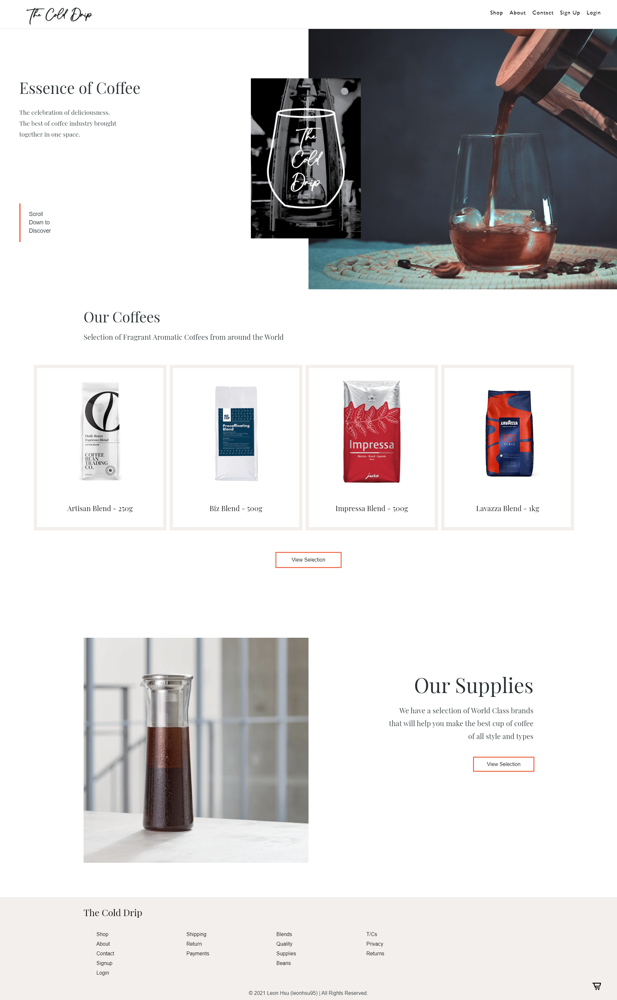

# THE COLD DRIP COFFEE

You can view THE COLD DRIP COFFEE here: [THE COLD DRIP COFFEE](https://the-cold-drip.herokuapp.com/)

## Table of Contents

- [Description](#description)
- [Usage](#usage)
- [Credits](#credits)
- [Copyright](#copyright)
- [License](#license)
- [Features](#features)
- [Improvements](#improvements)
- [Tests](#tests)

## Description

THE COLD DRIP is a Coffee ECommerce MERN Website that is the platform to sell all things coffee from bean varieties, blends and supplies.
Consumers can use this platform as the all-in-one place to purchase what they need to achieve making the perfect cup of coffee or even start up their own café.
The website also aims to be a coffee cultural hub, giving visitors access to resources to learn more about coffee and inform them about sales and discounts.

## Technologies

Technologies used in this portfolio include:
 * HTML
 * CSS
 * JS/ES6
 * React
 * NodeJS and npm packages
    * Global
        * concurrently (run npm i concurrently before npm run install)
    * Client
        * react (npx-create-react-app)
        * styled-components
        * node-sass
    * Server 
    * apollo-server-express version "^2.11.0"
        * The app won't work with the latest version due to how it handles middleware functions differently. Install version 2.x...
    * bcrypt
    * dotenv
    * express
    * graphql
    * jsonwebtoken
    * mongoose
    * nodemon
    * stripe

## Usage

My portfolio should look like this, please do not recreate or reuse under any circumstances without permission:

 

## Credits

Project created, designed and developed by Leon Hsu [2021] [leonhsu95].

## Copyright

THE COLD DRIP is protected by Copyright © 2021 COMPASS ARK STUDIOS | All Rights Reserved.

This work may not be reprinted, reproduced or reused under any circumstances. 

## License

UNDER NO CIRCUMSTANCES CAN THIS WORK BE COPIED, REPRODUCED OR REUSED.

## Features
- As a React Website, load times to fetch data are quick for UX

- Users can view products and items, adding to cart and buy with payment processed by Stripe

- New Products can be added as a new purchase item for customers to buy

## Improvements
- Make “Add Products” a feature that user admins can only use
- Image uploading to go along with “Add Products” feature
- Search function to find specific products
- User reviews
- Add Shipping and Delivery information
- Profile page that users can customize and repeat orders
- Prevent users to add to cart when not logged in
- Make a printable receipt based on order history and shipping info

## Tests

Website is validated with [HTML Markup Validation Tool](https://validator.w3.org/), [CSS Validation Service](https://jigsaw.w3.org/css-validator/) and [JS Validation Service](https://jshint.com/). React and JavaScript's "Strict Mode" enforces code linting. Optionally, you can use [JWT.IO](https://jwt.io/) to check JWT tokens credential.